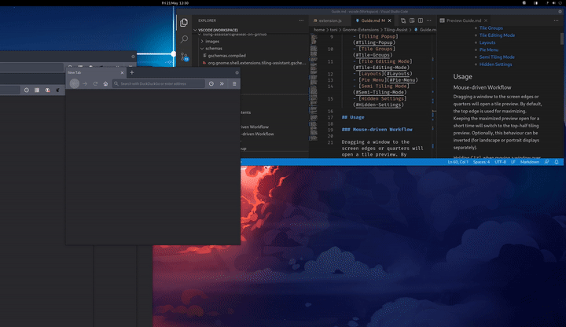
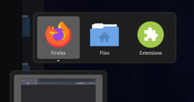
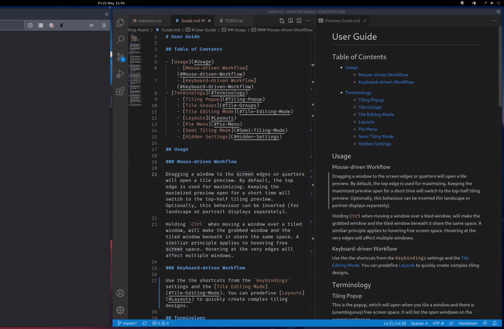
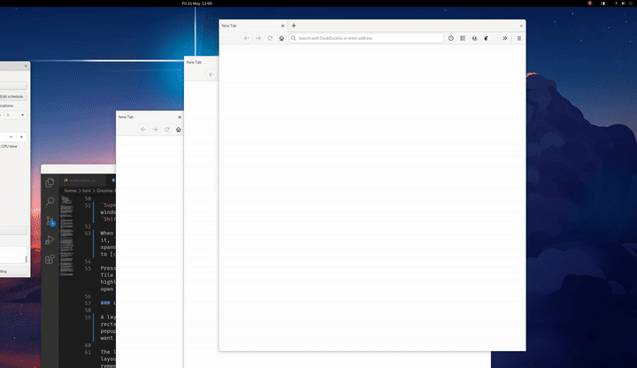
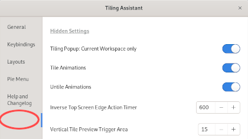

# User Guide

## Table of Contents

- [Usage](#Usage)
    - [Mouse-driven Workflow](#Mouse-driven-Workflow)
    - [Keyboard-driven Workflow](#Keyboard-driven-Workflow)
- [Terminology](#Terminology)
    - [Tiling Popup](#Tiling-Popup)
    - [Tile Groups](#Tile-Groups)
    - [Tile Editing Mode](#Tile-Editing-Mode)
    - [Popup Layouts](#Popup-Layouts)
    - [Hidden Settings](#Hidden-Settings)

## Usage

### Mouse-driven Workflow

Dragging a window to the screen edges or quarters will open a tile preview. By default, the top edge is used for maximizing. Keeping the maximized preview open for a short time will switch to the top-half tiling preview. Optionally, this behaviour can be inverted (for landscape or portrait displays separately).

Holding `Ctrl` when moving a window over a tiled window, will make the grabbed window and the tiled window beneath it share the same space. A similiar principle applies to hovering free screen space. Hovering at the very edges will affect multiple windows.

### Keyboard-driven Workflow

Use the the shortcuts from the `Keybindings` settings and the [Tile Editing Mode](#Tile-Editing-Mode).

## Terminology

### Tiling Popup

This is the popup, which will appear when you tile a window and there is (unambiguous) free screen space. It will list the open windows on the current workspace.

The popup's app icons can be activated with `Space`, `Enter`, and `Right` or `Middle Mouse Button`. Activating one of the popup's app icons will tile the corresponding window to fill the free screen space.

Holding `Shift` or `Alt` while activating an app icon, will tile the window to the top/left or bottom/right half of the free space depending on the space's orientation (aka spiral/dwindle tiling).

### Tile Groups

When a window is tiled, the top-most tiled windows, which don't overlap each other, are considered in a group. That means they will be raised to the foreground together, if one of them is raised. Resizing one of the windows will also affect the other windows in the group.

### Tile Editing Mode

This is a special mode to manage your tiled windows with your keyboard.

You can navigate focus with the direction keys (`WASD`, `hjkl` or the `arrows`). Holding `Ctrl` while moving the focus and then releasing `Ctrl` will swap the highlighted windows. If you hold `Shift` as well instead of swapping the 2 highlighted windows, the sizes of the 2 windows and the windows between them will be equalized (*either* the width *or* the height based on the position of the 2 highlighted windows).

`Super` + `Directions` will resize the selected window on the E or S side. Additionally, holding `Shift` will resize the window on the W or N side.

When a window is highlighted, press `Q` to [q]uit it, `R` to [r]estore its size, and `E` to [e]xpand it to fill the available space. Press `C` to [c]ycle through 'half' states of a window.

Hitting `Esc`, `Space` or `Enter` will leave the Tile Editing Mode. If a free screen rectangle is highlighted, pressing `Space` or `Enter` will open the Tiling Popup instead.

### Popup Layouts

A Popup Layout consists of a list of arbitrary rectangles. When activating a popup layout, the tiling popup will ask you which of the open windows you want in which rectangle of your layout. Read the tooltip in the `Popup Layouts` settings to understand how to set them up.

The `Popup Layout Selector` enables you to search for layouts by name. That means you don't have to remember their keybindings.

The settings for the `Popup Layouts` are [hidden](#Hidden-Settings) by default.

### Hidden Settings

This is a 'hidden' (more specificly: nameless) tab under `Help`. It contains minor (i. e. things I don't expect the general user to ever need), debugging, and experimental settings.

