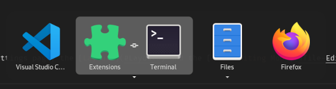
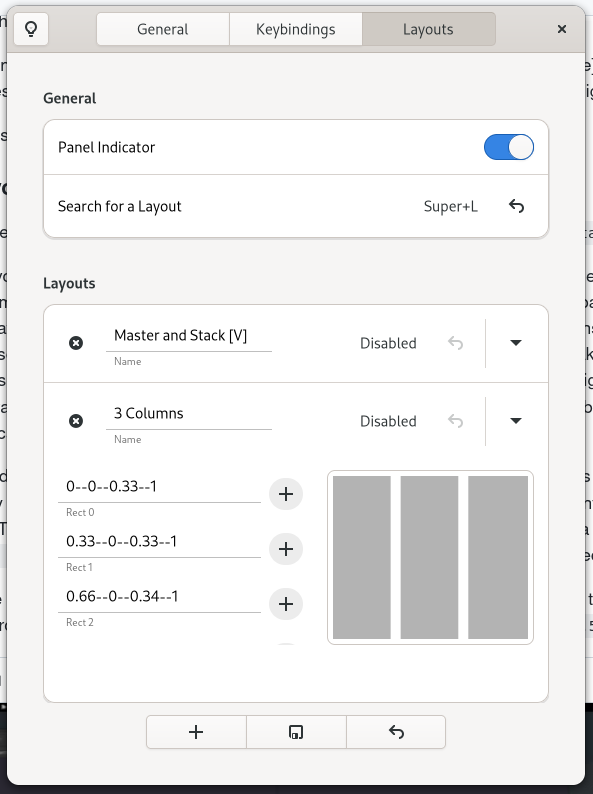

# User Guide

## Table of Contents

- [Usage](#Usage)
    - [Mouse-based Workflow](#Mouse-based-Workflow)
        - [Edge Tiling](#Edge-Tiling)
        - [Split Tiles](#Split-Tiles)
        - [Favorite Layout](#Favorite-Layout)
    - [Keyboard-based Workflow](#Keyboard-based-Workflow)
- [Terminology](#Terminology)
    - [Tiling Popup](#Tiling-Popup)
    - [Tile Groups](#Tile-Groups)
    - [Tile Editing Mode](#Tile-Editing-Mode)
    - [Layouts](#Layouts)
    - [Hidden Settings](#Hidden-Settings)

## Usage

### Mouse-based Workflow

There are three ways to tile windows with your mouse: `Edge Tiling`, the `Split Tiles` mode and the `Favorite Layout`.

#### Edge Tiling

 This mode is used when you grab a window and drag it to the screen edges. A `Tile Preview` will open and show the area the window will tile to once the grab is released. By default, the `Tile Preview` will either be a screen half or quarter depending on the position of your mouse. If there are tiled windows visible on the screen, the `Tile Preview` will adapt its size. The top screen edge is used for maximizing. Keeping the maximized preview open for a short time will switch to the top-half preview.

 If you use multiple monitors: There is a very short `Grace Period` (150 ms) when your mouse changes monitors, in which the `Tile Preview` will stick to the old monitor. This way you can _throw_ (tile) your windows without needing to slowly inch towards a screen edge, if there is another monitor beyond that edge.

#### Split Tiles

You use this by dragging a window around while holding `Ctrl`. In this mode you split or replace tiles (that means either tiled windows or the free screen space created by tiled windows), if you hover over them. If you hover at the center of the tile, the full tile will be covered. If you hover off-center, the grabbed window will only tile to one half of the full tile. If the hovered tile is a tiled window, the tiled window will take the remaining half. If you hover at the edges of a tile (i. e. within 50 px of an edge), multiple tiled windows will be affected by that. If you _additionally_ hold `Super`, the grabbed window will span multiple tiles.

https://user-images.githubusercontent.com/53054301/144303811-97f532c1-9a02-47c7-ae57-4e1d7e960276.mp4

#### Favorite Layout

The `Favorite Layout` is a user-defined layout, which doesn't adapt its tiles' sizes to the visible tiled windows. You can tile a window to a tile of your favorite layout by dragging it around and holding `Alt`. If you _additionally_ hold `Super`, the window will span multiple tiles of your layout. A normal layout can be marked as a favorite using the `Panel Indicator`. Each monitor can have its own favorite layout. See [Layouts](#Layouts) for information on how to setup a normal layout.

https://user-images.githubusercontent.com/53054301/144303875-ec29707a-0c27-4420-bb0c-a99858222455.mp4

### Keyboard-based Workflow

Use the the keyboard shortcuts from the `Keybindings` settings page, the [Layouts](#Layouts) and the [Tile Editing Mode](#Tile-Editing-Mode).

## Terminology

### Tiling Popup

This is the popup, which will appear when you tile a window and there is (unambiguous) free screen space. It will list the open windows on the current workspace.

The popup's app icons can be activated with `Space`, `Enter`, and `Right` or `Middle Mouse Button`. Activating one of the popup's app icons will tile the corresponding window to fill the free screen space.

Holding `Shift` or `Alt` while activating an app icon, will tile the window to the top/left or bottom/right half of the free space (à la spiral/dwindle tiling) depending on the space's orientation.

### Tile Groups

When a window is tiled, the top-most tiled windows, which don't overlap each other, are considered in a group. That means they will be raised to the foreground together, if one of them is raised. Resizing one of the windows will also affect the other windows in the group. Tile groups can be show as one item in the App Switcher.

### Tile Editing Mode

This is a special mode to manage your tiled windows with your keyboard.

You can navigate focus with the direction keys (`WASD`, `hjkl` or the `arrows`). Holding `Ctrl` while moving the focus and then releasing `Ctrl` will swap the highlighted windows.

`Super` + `Directions` resizes the selected window. This follows GNOME's native resizing behaviour. That means, if you resize on one side and then want to resize on the opposite side, you first need to go to a neighbouring side of your current side before you can go to the opposite side. For intance, if you are currently in-/decreasing the window size on the North side using the `up` and `down` arrows (or `w`/`s` and `j`/`k`) and then want to resize on the South, you first need to go the West or East side with the `left` or `right` arrows before you can use `down` to reach the South side.

When a window is highlighted, press `Q` to [q]uit it, `R` to [r]estore its size. `E` to [e]xpand it to fill the available space, `C` to [c]ycle through 'half' states of a window and `Space` to open the `Tiling Popup` for the currently highlighted tile.

Pressing `Esc` or `Enter` will leave the Tile Editing Mode.

### Layouts

By default, the layouts' settings page is [hidden](#Hidden-Settings) behind the `Advanced/Experimental Settings` toggle.

A layout is defined by a list of rectangles. Each rectangle can have an app attached to it and loopType set. Optionally, a layout may be assigned a name and a keyboard shortcut for activation. If you activate a layout, you will spawn a Tiling Popup at each rectangle — one after the other. If you attached an app to the rectangle, instead of calling the Tiling Popup, a new instance of the app will be opened and tiled to that rectangle. If you set a loopType, you will keep tiling windows to that specific rectangle and make the tiled windows share that space evenly. This way you can setup layouts similiar to a Master-and-Stack layout. Other than using the assigned keyboard shortcut for a layout activation, you can also activate a layout using the `Panel Indicator` or the `Search for a layout` keyboard shortcut. The later will show a list of all layouts, which you can choose one from.

You define a layout's rectangles by entering their `x` and `y` coordinate as well as their `width` and `height` into a text entry separated by `--`. They are floating point values and can range from 0 to 1. The point (0,0) represents the top-left of your workspace and (1,1) the bottom-right. A loopType is set by appending `--h` or `--v` to the text entry for a horizontal and a vertical loop respectively. You can attach an app by using the `Add Button` to the right of a text entry. It acts like a toggle. If you already attached an app to it, clicking it again, will remove the app.

Here is a video to illustrate it. The text entry at row 0 defines a horizontal loop for the top-right quarter (`.5--0--.5--.5--h`) of my workspace and row 1 defines a non-looped rectangle at the bottom-right quarter (`.5--.5--.5--.5`) with an app (`Calender`) attached to it.

https://user-images.githubusercontent.com/53054301/144303907-fd3e5d1b-da42-4b6c-8b13-dbad701e5ba7.mp4

You can mark one layout (per monitor) as a favorite. See [Favorite Layout](#Favorite-Layout) for more information.

### Hidden Settings

This is a hidden settings page. It contains minor, debugging, advanced and experimental settings. You can access it by clicking the `Advanced...` menu item, which appears when clicking the titlebar button.
