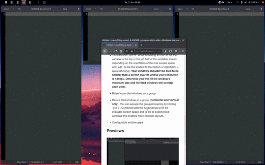
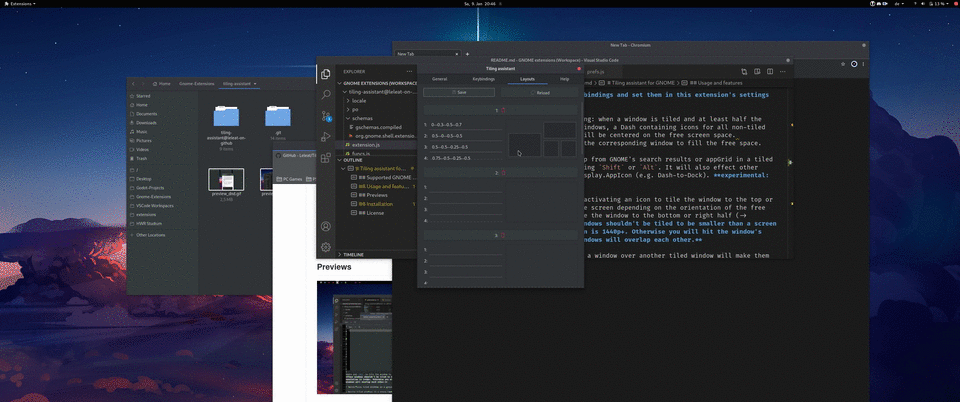

# Tiling assistant for GNOME

An extension which adds a Windows-like snap assist to GNOME. It also changes GNOME's 2 column tiling design to a 2x2 grid (i.e. 4 quadrants).

## Supported GNOME versions

- 3.36
- 3.38
- 40

Development started on GNOME 3.36. But as of November 2020 all development happens on 3.38. While it may (and I think it still should) work on 3.36, I can't test it. 

## Usage and features

**Disable GNOME's default keybindings and set them in this extension's settings page.**

- Windows-like (quarter) tiling: when a window is tiled and at least half the screen is occupied by tiled windows, a Dash containing icons for all non-tiled windows will open. The Dash will be centered on the free screen space.
Activating an icon will tile the corresponding window to fill the free space.

- You can hold `Shift` while activating an icon from the Dash to tile the window to the top or the left half of the available screen space depending on the orientation of the free screen space and `Alt` to tile the window to the bottom or right half ("spiral-ish" tiling).

- Holding `Ctrl` while DNDing a window over another tiled window will make them share the same space (idea from the Shelltile extension). Similiar behaviour applies to hovering empty screen space. Holding `Ctrl` will also use the default sizes for the tiling at the screen edges.

- Define up to 10 layouts. On pressing the corresponding keybinding the Dash will open and ask you which window you want in which spot of the layout. Read the tooltip in the `Layouts` tab on how to you can define them.

- Raise tiled windows as a group.

- Resize tiled windows in a group (**horizontal and vertical only**). You can escape the group-resizing by holding `Ctrl`. This way only the windows directly opposed to the resized window will resize along.

- When using the `tile to other tiled window` keybinding, pressing `Ctrl` will halve the rectangles vertically. Another `Ctrl` press will halve the rectangles horizontally.

## Installation

You can install it via https://extensions.gnome.org. Alternatively (or if you want an up-to-date version), download `tiling-assistant@leleat-on-github` and move it to your extensions folder. Local extensions are in `~/.local/share/gnome-shell/extensions/`. After moving the folder to the correct location, restart the GNOME shell (`Alt`+`F2` -> enter `r`. On **Wayland** you need to logout).

## License

This extension is distributed under the terms of the GNU General Public License, version 2 or later. See the license file for details.

## Previews

### DNDing

### Layouts

