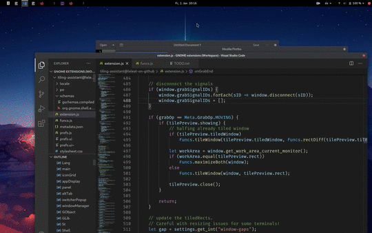

# Tiling assistant for GNOME

An extension which adds a Windows-like snap assist to GNOME. It also changes GNOME's 2 column tiling design to a 2x2 grid (i.e. 4 quadrants).

## Supported GNOME versions

- 3.36
- 3.38

Development started on GNOME 3.36. But as of November 2020 all development happens on 3.38. While it may (and I think it still should) work on 3.36, I can't test it.

## Usage and features

**Disable GNOME's default keybindings and set them in this extension's settings page.**

- Windows-like (quarter) tiling: when a window is tiled and at least half the screen is occupied by tiled windows, a Dash containing icons for all non-tiled windows will open. The Dash will be centered on the free screen space. 
Activating an icon will tile the corresponding window to fill the free space.

- You can directly open an app from GNOME's search results or appGrid in a tiled state (left or right) by holding `Shift` or `Alt`. It will also effect other extensions which extend appDisplay.AppIcon (e.g. Dash-to-Dock). **experimental: needs feedback**

- You can hold `Shift` while activating an icon to tile the window to the top or the left half of the available screen depending on the orientation of the free screen space and `Alt` to tile the window to the bottom or right half (-> spiral-ish tiling). **Your windows shouldn't be tiled to be smaller than a screen quarter unless your resolution is 1440p+. Otherwise you will hit the window's minimum size and the tiled windows will overlap each other.**

- Holding `Ctrl` while DNDing a window over another tiled window will make them share the same space. See the dnd preview below. (Idea from the Shelltile extension). Hovering over empty space while holding `Ctrl` will tile to that space.

- Raise/focus tiled windows as a group.

- Resize tiled windows in a group (**horizontal and vertical only**). You can escape the group-resizing by holding `Ctrl` (doesn't work with GTK apps). This way only the windows directly opposed to the resized window will resize along. Combined with the keybindings to fill the available screen space and to tile to existing tiled windows this enables more complex layouts.

- Configurable window gaps

## Previews

## Installation

You can install it via https://extensions.gnome.org. Alternatively (or if you want an up-to-date version), you can download the `tiling-assistant@leleat-on-github` folder and move it to your extensions folder. Local extensions are in `~/.local/share/gnome-shell/extensions/`.
